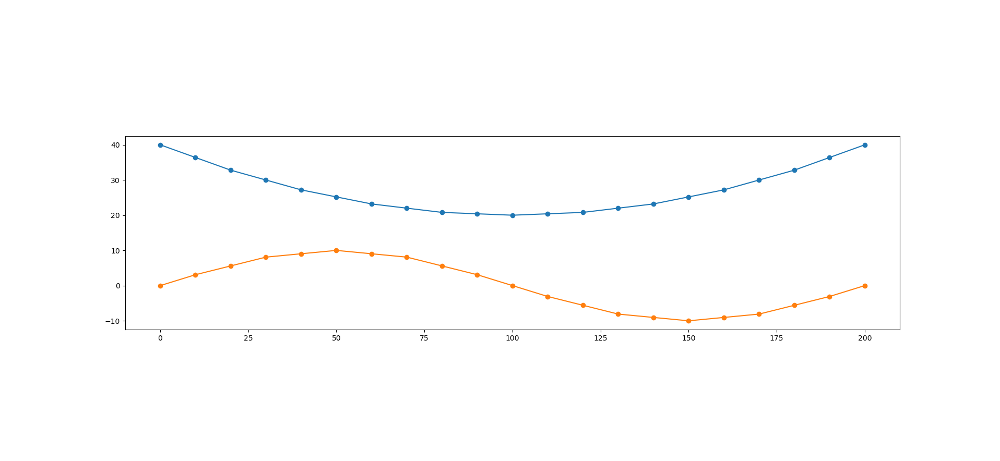
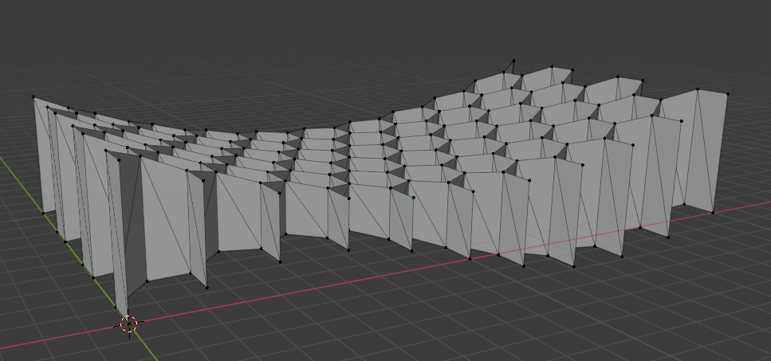
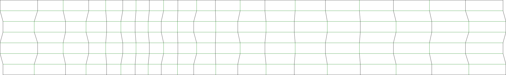

# Kirigami Honeycomb FLDs

A tool for converting arbitrary geometry into kirigami honeycomb folding line diagrams (FLD). This projects is still in its early stages.

## Prior Work

The idea is based on two publications from Saito et al.:

- Saito, K., Pellegrino, S., Nojima, T., 2014. Manufacture of Arbitrary Cross-Section Composite Honeycomb Cores Based on Origami Techniques. Journal of Mechanical Design 136, 051011. https://doi.org/10.1115/1.4026824
- Saito, K., Fujimoto, A., Okabe, Y., 2016. Design of a 3D Wing Honeycomb Core Based on Origami Techniques, in: Volume 5B: 40th Mechanisms and Robotics Conference. Presented at the ASME 2016 International Design Engineering Technical Conferences and Computers and Information in Engineering Conference, American Society of Mechanical Engineers, Charlotte, North Carolina, USA, p. V05BT07A026. https://doi.org/10.1115/DETC2016-60419

The first paper explains how arbitrary cross sections can be converted to kirigami folding line diagrams. It can be accessed [here](https://core.ac.uk/download/pdf/33110081.pdf). In the second, this idea is further developed to morph the honeycomb cells to also cover 3D shapes.

Sadly, no source code has been published alongside. The mathematical description of the algorithm inside both papers is not correct to my understanding. Therefore, I have written my own implementation of the simplified algorithm (explained in detail below) based on the provided examples and (quite excellent) figures.

## The Idea Behind

I have been looking for a way to build larger structures of freeform geometry. While 3D printers work well for tiny parts they are limited by their build volume. Manufacturing kirigami patterns with a laser cutter allows larger structures that still can be made at home with relatively few and cheap tools. In the end, this tool should allow to load a geometry mesh and provide the corresponding folding line diagram that matches the input geometry as close as possible when folded. While the goal is pretty clear, the process to get there is not.

## What should this tool be able to do?

- load any geometry and process it into a FLD
- overcome the limitation that the arbitrarily shaped cross section is fixed along the third axis 
  - add perforated lines to remove additional material; this should result in the wanted geometry
- be able to split the FLD into multiple parts that can be joined back together after folding
  - this is needed because laser cutters are limited in the sheet size they can work on
  - the FLD approximates the outer curves of the mesh
  - inner cavities should also be drawn on the FLD as perforations that can be removed after folding and gluing 

## Defining The Process

For now, I am still deciding on how to achieve the above mentioned goal. The biggest decision seems to be wheter to develop this as a standalone program or as a Blender addon.

These are the steps needed to produce the FLD for any geometry:

- Load geometry from external file
- partition mesh into multiple zones, depending on manufacturing constraints (maximum size of sheets)
  - have the user select some parameters:
    - manually define zones
    - direction of folding 
    - honeycomb cell size
    - controls for the following steps...
- in each zone determine the upper and lower curve (hull of projection); right now this is defined by two functions
- sample functions in honeycomb cell size steps
  - build a linear approximation (this is needed to obtain a foldable end result!)
  - add offset so that original geometry is definitely inside the linear approximation
- calculate FLD parameters and create first iteration FLD (no cavities nor perforation lines for exact outer hull)
- build 3D honeycomb mesh of the FLD
- intersect the real geometry with the honeycomb mesh
- transform intersection points (optimally polylines) from 3D onto 2D FLD
  - create perforation lines 
 

## Contributing

If you have an idea regarding this tool, please let me know by creating an issue. As it is still in its design phase, I won't be accepting pull request. This will change when the shape of this project becomes clearer.

## License

MIT, see LICENSE file
